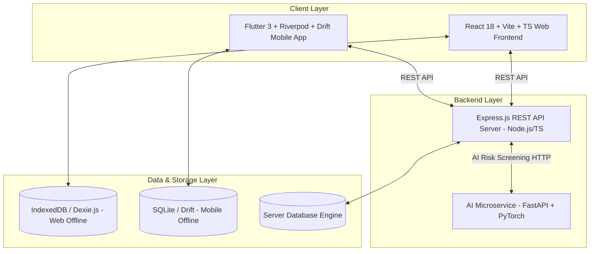

# 🐾 PashuMitra (पशु मित्र)
### *AI-Powered Multi-Modal Livestock Health Management, Early Disease Surveillance & GIS Decision Support System*

[](https://opensource.org/licenses/MIT)
[](https://nodejs.org/)
[](https://reactjs.org/)
[](https://www.typescriptlang.org/)
[](https://fastapi.tiangolo.com/)
[](https://flutter.dev/)

---

## 📌 Overview

**PashuMitra** (Pashu Sanrakshan) is a full-stack, cross-platform livestock health management and epidemiological disease surveillance ecosystem. Designed to empower farmers, field veterinarians, paravets, and agricultural health authorities, the platform integrates **multi-modal AI risk screening (Computer Vision + Structured Data + GIS)** with **offline-first capabilities** to facilitate early disease detection, rapid triage, and containment of livestock disease outbreaks (e.g., Foot-and-Mouth Disease, Lumpy Skin Disease, Anthrax).

---

## ✨ Key Features

### 🌾 Farmer Web & Mobile Portal
- **Herd & Livestock Management**: Digital profiles for cattle, buffalo, goats, sheep, and other livestock with medical logs, age/breed tracking, and vaccination history.
- **Guided Symptom & Image Reporting**: Step-by-step reporting interface for farmers to record physical symptoms, upload lesion/discharge photos, and capture GPS coordinates.
- **Instant AI Risk Gauge**: Real-time preliminary risk classification (**Low**, **Medium**, **High**, **Critical**) with dynamic initial guidance and emergency care advice.
- **Offline Storage Sync**: Seamless offline-first experience using Dexie.js (Web IndexedDB) to queue reports in remote areas with poor network connectivity.

### 🩺 Veterinary Command Center & Triage
- **Case Management & Triage Queue**: Real-time dashboard for veterinarians to prioritize urgent cases, review AI confidence scores, issue prescriptions, and log treatment outcomes.
- **Epidemiological Cluster Alerts**: Automated detection of spatial-temporal disease clusters to warn veterinary officers of impending outbreaks.
- **Interactive GIS Heatmaps**: Map-based surveillance using Leaflet, featuring risk perimeters, containment radius overlays, and regional disease density filters.
- **Lab & Follow-Up Workflows**: Field sample tracking, laboratory diagnostic linking, and structured treatment follow-up schedules.

### 🤖 Multi-Modal AI Risk Engine (`ai_service`)
- **Computer Vision (PyTorch / YOLO)**: Automated visual analysis of uploaded livestock imagery for lesion detection, posture anomalies, and mucosal/nasal discharge indicators.
- **Epidemiological Rule Engine**: Hybrid expert system matching user-reported symptoms against clinical livestock taxonomies.
- **GIS Spatial Risk Factor**: Dynamic weighting based on proximity to active outbreak clusters and historical regional incidence rates.

### 📲 Field Mobile Application (`pashumitra_mobile`)
- **Offline-First Architecture**: Built with Flutter and **Drift (SQLite)** to allow field veterinarians and paravets to operate without internet connections.
- **Mobile AI Screening Wizard**: On-device diagnostic support tool for fast field evaluations.
- **Field Navigation & Mapping**: Integrated mapping interface for farm visit navigation and spatial tagging.

---

## 🏗️ System Architecture



---

## 🛠️ Tech Stack

| Module | Core Technology | Key Libraries & Frameworks |
| :--- | :--- | :--- |
| **Web Frontend** | React 18, Vite, TypeScript | Tailwind CSS, Lucide Icons, Recharts, React-Leaflet, Zustand, Dexie.js |
| **Backend API** | Node.js, Express.js, TypeScript | JWT, Multer, CORS, tsx |
| **AI Microservice** | Python 3.10+, FastAPI | Uvicorn, PyTorch, OpenCV, NumPy, Pydantic |
| **Mobile Application** | Flutter 3, Dart | Riverpod, GoRouter, Drift (SQLite), Dio, Flutter Map |

---

## 📁 Repository Structure

```
vet health 2/
├── src/                      # React Web Frontend Application
│   ├── app/                  # App Providers & Routing Setup
│   ├── components/           # Reusable UI Components
│   ├── core/                 # API Client, State Management & Dexie IndexedDB
│   ├── features/             # Feature Modules (Farmer, Veterinary, AI, Auth)
│   └── types/                # Domain TypeScript Types & Models
├── server/                   # Express.js Backend API
│   ├── src/
│   │   ├── routes/           # REST Endpoints (Auth, Animals, Cases, Reports, Map, AI)
│   │   ├── services/         # Business Logic & AI Microservice Integrations
│   │   └── db.ts             # Database Schema & Seed Data Engine
├── ai_service/               # FastAPI Python AI Microservice
│   ├── app/                  # AI Pipeline Routes, Vision Models & Risk Algorithms
│   ├── main.py               # Microservice Server Entrypoint
│   └── requirements.txt      # Python Dependencies
├── pashumitra_mobile/        # Flutter Cross-Platform Mobile Application
│   ├── lib/                  # Dart Source Code (Core, Features, Models)
│   └── pubspec.yaml          # Flutter Package Specification
├── package.json              # Web Workspace Dependencies & Scripts
└── vite.config.ts            # Vite Configuration
```

---

## 🚀 Quick Start Guide

### Prerequisites
- **Node.js**: `v18.0.0` or higher
- **npm**: `v9.0.0` or higher
- **Python**: `v3.10` or higher
- **Flutter SDK**: `v3.x` (for mobile app)

---

### 1️⃣ Run Web Frontend & Express Backend

1. **Install Web & Server Dependencies**:
   ```bash
   # Install root web frontend dependencies
   npm install

   # Install backend server dependencies
   cd server
   npm install
   cd ..
   ```

2. **Start Development Servers**:
   ```bash
   npm start
   ```
   * Running `npm start` concurrently launches:
     - **Web Frontend**: `http://localhost:5173`
     - **Express Backend API**: `http://localhost:5001` (Health Check: `http://localhost:5001/api/health`)

---

### 2️⃣ Run the AI Risk Screening Microservice

1. **Navigate to `ai_service` directory**:
   ```bash
   cd ai_service
   ```

2. **Set up Python Virtual Environment**:
   ```bash
   # On Windows
   python -m venv venv
   .\venv\Scripts\activate

   # On Linux / macOS
   python3 -m venv venv
   source venv/bin/activate
   ```

3. **Install Requirements & Start Service**:
   ```bash
   pip install -r requirements.txt
   python main.py
   ```
   * **AI Microservice**: `http://localhost:8000`
   * **Swagger Interactive Docs**: `http://localhost:8000/docs`

---

### 3️⃣ Run the Mobile Application (Flutter)

1. **Navigate to `pashumitra_mobile` directory**:
   ```bash
   cd pashumitra_mobile
   ```

2. **Fetch Dependencies & Launch**:
   ```bash
   flutter pub get
   flutter run
   ```

---

## 📡 REST API Quick Reference

| Method | Endpoint | Description |
| :--- | :--- | :--- |
| `GET` | `/api/health` | Server Health Status |
| `POST` | `/api/auth/login` | User Authentication (Farmer / Vet) |
| `GET` | `/api/animals` | List Registered Herd Animals |
| `POST` | `/api/animals` | Register New Livestock |
| `GET` | `/api/reports` | Retrieve Symptom Reports |
| `POST` | `/api/reports` | Submit New Disease Report |
| `GET` | `/api/cases` | Get Veterinary Triage Queue & Active Cases |
| `GET` | `/api/map/clusters` | Fetch Spatial GIS Outbreak Clusters & Heatmaps |
| `POST` | `/api/ai/screen` | Trigger Multi-Modal AI Risk Assessment |

---

## 🌐 Offline Synchronization Mechanism

> [!NOTE]
> Network availability in rural areas can be unreliable. PashuMitra ensures uninterrupted data capture using local storage engines:

- **Web Portal**: Uses **Dexie.js** to record reports in browser IndexedDB when offline. Background workers auto-sync queued items when internet connectivity resumes.
- **Mobile App**: Uses **Drift (SQLite)** for offline relational storage, ensuring veterinarians can log farm visits, diagnostics, and treatments off-grid.

---

## 📜 License

This project is licensed under the **MIT License**.
